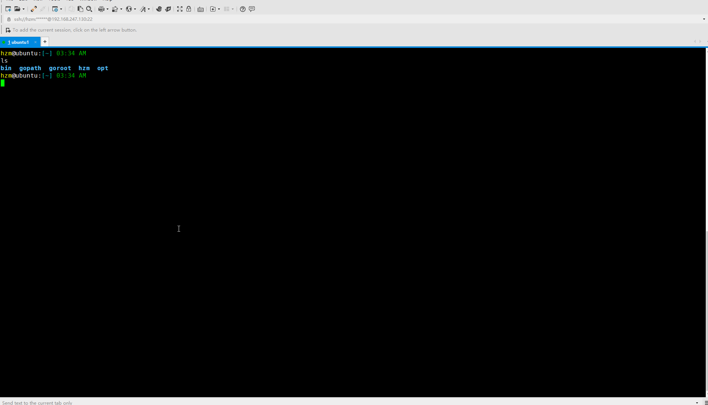

# vim
My vim configurations

## Usage
```
git clone 'git@github.com:hezhiming/vim.git' ~/.vim/

cd ~ && ln -sf ${HOME}/.vim/vimrc .vimrc


```

## Why
主要还是还是个人偏好的原因， 主要是：

1. 我不喜欢 SpaceVim 或 spf-vim 这类庞大的Vim配置，不喜欢记忆别人的快捷键，不喜欢按照别人的方式思考。
2. Vim 本身是一个很个性化的编辑器，每个人的配置几乎不同，这也与第1点相同。
3. 我比较喜欢明确清晰的东西，最好自己对这个东西具有掌控力。

所以我一般不会使用别人的vim的配置，折腾Vim的快感在于 100% 的掌控力，使用 SpaceVim 并不能让我有这种快感。另外，在我的认知中，Vim不过是
编辑器，所以我拒绝将其配置成为一个 IDE 的行为，比如去添加YCM/python-mode这种插件，专业的事情应该交给专业的IDE （ 一直不理解为啥会有人
用Vim去写Java ）。

## How
根据前文所述，其实我并不喜欢 “快捷键” 这种东西，所以 Vim 本身的快捷键，我也只记住了一点点。各种插件的快捷键，我一般直接忽略，更不会去
记忆。

那么如何使用呢？

观察其目录结构，其实非常简单
```
autoload/       vim会自动加载这个目录， 其实只有一个插件管理器
colors/         Theme配置，我只是用 peaksea 这款配色主题，对服务端开发者非常友好（不容易让视力疲劳）
confs/          主配置目录
    basic.vim     一些基本配置，比如缩进什么的
    autocmd.vim   一些自动命令
    mappings.vim   快捷键映射（由于我不是很喜欢记忆快捷键，所以这个文件的内容基本快删光了）
    plugins.vim    插件配置，它会加载 _plugins/ 下面的所有vim文件
    _plugins/
        ctrlp.vim  ctrlp的配置

vimrc           主加载入口，相当于 main 入口，其内容十分简单，就是将 confs/ 下面的vim文件全部加载进来
```

那么，要使用就是很简单了：
```
1. 拷贝仓库。
    git clone 'git@github.com:hezhiming/vim.git' ~/.vim/
    ln -sf ~/.vim/vimrc  .vimrc                                     Vim会读取 .vimrc，所以我们软连接即可
2. 安装插件。
    我使用 PlugVim 管理插件，所以随便打开一个文件，然后运行 PlugInstall 即可 （Vim会自动补全命令）
3. 使用。
```


下面是一个操作截图（注：我基本很少使用快捷键，一般使用命令补全，其实效率更高）


## 基本的快捷键操作
主要是Vim基本的快捷键操作。基本的快捷键操作，没有改一个，都是默认的。

Leader键是“英文逗号”

重要的：
1. 在窗口间跳转，Ctrl hjkl。比如 Ctrl h 跳转到左边窗口
2. 在Tab页之间跳转，bn/bp。比如 bn 跳转到下一个标签页

如何使用插件：
1. 主要使用命令行，从不使用该插件的任何快捷键（唯一的一个是：CtrlP 的 Ctrl p ）
2. 比如 NerdTree 的，直接在命令模式下输入 NERDTreeToggle 即可（其实这样做，效率是很高的，Emacs基本都是这样搞的）